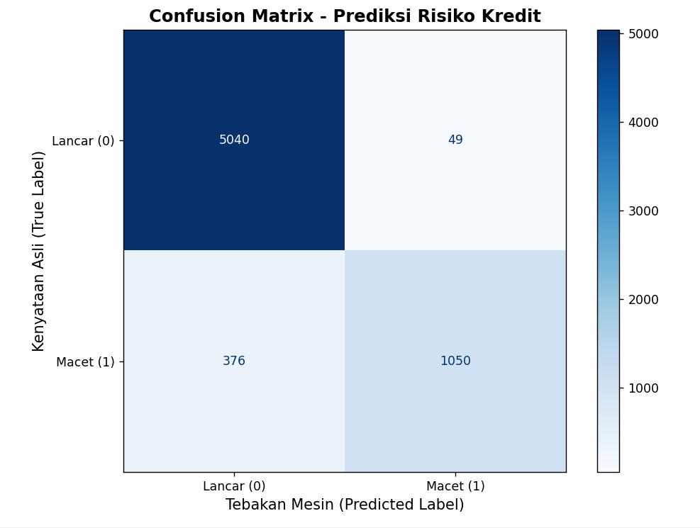

# 🏦 Prediksi Risiko Kredit (Credit Risk Classification)
**End-to-End Data Pipeline & Machine Learning Model menggunakan Python**

## 📌 Latar Belakang & Objektif Bisnis
Dalam industri perbankan, mengidentifikasi calon nasabah yang berisiko gagal bayar (*default*) adalah krusial untuk meminimalisir status *Non-Performing Loan* (NPL). Proyek ini bertujuan untuk membangun model prediksi risiko kredit berbasis *machine learning* yang mampu mengklasifikasikan nasabah ke dalam kategori **Lancar (0)** atau **Macet (1)** berdasarkan profil historis, data finansial, dan tujuan pinjaman mereka.

## 🗄️ Dataset
*   **Sumber:** Credit Risk Dataset
*   **Dimensi Awal:** 32.581 baris dan 12 kolom fitur.
*   **Target Prediksi:** Kolom `loan_status` (1 = Gagal Bayar, 0 = Lancar).

## 🛠️ Metodologi Analisis (Pipeline)

### 1. Data Cleaning & Penanganan Anomali (Algoritma Tradisional)
Proses pembersihan data dilakukan secara deterministik untuk memastikan integritas data sebelum masuk ke tahap pemodelan:
*   **Missing Values:** Melakukan imputasi nilai kosong pada kolom *employment length* dan *interest rate* menggunakan nilai Median agar tidak mendistorsi distribusi data.
*   **Outlier Removal:** Menghapus baris data mustahil secara logis (misalnya, nasabah dengan `person_age` > 80 tahun dan pengalaman kerja > 60 tahun). Total 9 baris anomali dibuang secara permanen.

### 2. Exploratory Data Analysis (EDA)
Analisis bivariat dilakukan untuk menemukan korelasi awal antara tujuan pinjaman dan risiko macet.

*Insight:* Secara historis, pinjaman untuk tujuan medis (`MEDICAL`) dan konsolidasi utang (`DEBTCONSOLIDATION`) memiliki rasio gagal bayar tertinggi, sedangkan pinjaman modal usaha (`VENTURE`) adalah yang paling aman.

### 3. Data Preprocessing & Modeling
*   **Encoding:** Menerapkan *One-Hot Encoding* (`pd.get_dummies(drop_first=True)`) untuk menerjemahkan variabel teks menjadi format biner (matriks data berkembang menjadi 23 kolom).
*   **Data Splitting:** Rasio 80% Data Latih (26.057 baris) dan 20% Data Uji (6.515 baris).
*   **Algoritma:** *Random Forest Classifier* (`n_estimators=100`) dipilih karena ketahanannya terhadap skala data (*tabular data*) dan kemampuannya melacak alur keputusan (bukan *black box*).

## 📊 Hasil Evaluasi & Wawasan Bisnis (*Business Insights*)

Model dievaluasi menggunakan metrik klasifikasi standar dengan batas keputusan baku (Threshold = 0.5).

**Rapor Performa Model:**
*   **Akurasi (93.5%):** Model secara umum sangat baik dalam menebak profil keseluruhan nasabah.
*   **Presisi (95.5%):** Tingkat kesalahan *False Positive* sangat rendah. Jika model menuduh nasabah akan macet, tebakannya 95.5% akurat.
*   **Recall (73.6%):** Tingkat kepekaan model dalam menangkap *seluruh* nasabah buruk. Terdapat ruang untuk optimasi lebih lanjut (misalnya melalui kalibrasi *threshold*) karena saat ini mesin masih melewatkan sekitar 26% nasabah gagal bayar (False Negatives).

### 🏆 Faktor Penentu Kredit Macet (Feature Importance)

Model Random Forest membuktikan secara matematis bahwa **alasan meminjam tidak sepenting kondisi riil dompet nasabah**. Tiga pemicu utama kredit macet adalah:
1.  **Rasio Pinjaman terhadap Pendapatan (`loan_percent_income`):** Beban cicilan yang memakan porsi terlalu besar dari gaji bulanan adalah indikator bahaya paling absolut.
2.  **Total Pendapatan (`person_income`):** Kapasitas finansial absolut nasabah.
3.  **Suku Bunga (`loan_int_rate`):** Beban bunga yang tinggi mempercepat risiko gagal bayar pada nasabah berpendapatan pas-pasan.

## 💻 Tech Stack
*   **Bahasa:** Python 3
*   **Pustaka Analitik:** Pandas
*   **Pustaka Machine Learning:** Scikit-Learn
*   **Pustaka Visualisasi:** Matplotlib, Seaborn
