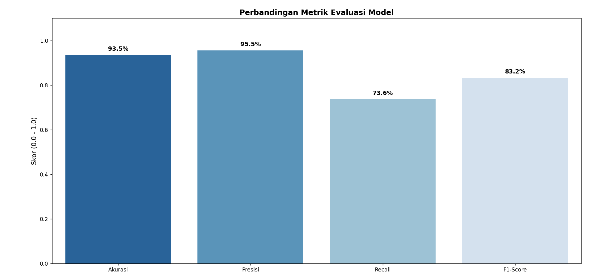
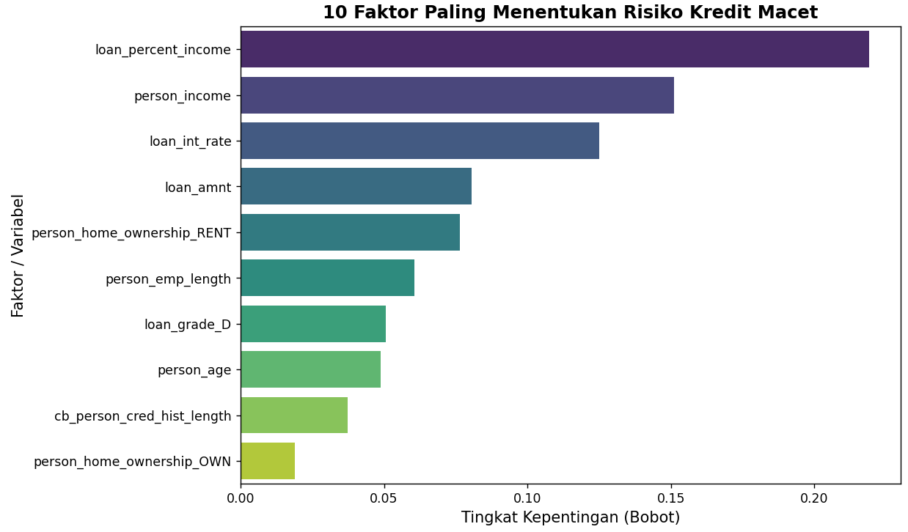

# 🏦 Prediksi Risiko Kredit (Credit Risk Classification)
**End-to-End Data Pipeline & Multi-Model Machine Learning Benchmarking menggunakan Python**

## 📌 Latar Belakang & Objektif Bisnis
Dalam industri perbankan, mengidentifikasi calon nasabah yang berisiko gagal bayar (*default*) sangat krusial untuk meminimalisir status *Non-Performing Loan* (NPL). Proyek ini membangun sistem prediksi risiko kredit komparatif berbasis *machine learning* yang mengklasifikasikan nasabah ke dalam kategori **Lancar (0)** atau **Macet (1)** berdasarkan profil historis, data finansial, dan tujuan pinjaman mereka.

## 🗄️ Dataset & Preprocessing
*   **Sumber:** Credit Risk Dataset
*   **Dimensi Data Awal:** 32.572 baris dan 12 kolom fitur.
*   **Dimensi Setelah Encoding:** 32.572 baris dan 23 kolom (setelah diterapkan *One-Hot Encoding*).
*   **Data Splitting:** Rasio 80% Data Latih (26.057 baris) dan 20% Data Uji (6.515 baris).

## 🛠️ Metodologi & Model Benchmarking
Proyek ini menguji dan membandingkan **6 algoritma *machine learning* berbeda** secara paralel untuk menemukan solusi prediktif paling optimal bagi institusi keuangan:
1. Logistic Regression
2. Naive Bayes
3. Random Forest
4. XGBoost
5. LightGBM
6. CatBoost

## 📊 Hasil Perbandingan Performa Model (*Benchmarking Result*)

Berikut adalah tabel rekapitulasi performa keenam model yang diuji pada data uji (6.515 baris):

| Model | Akurasi (%) | Presisi (%) | Recall (%) | F1-Score (%) | ROC-AUC (%) |
| :--- | :---: | :---: | :---: | :---: | :---: |
| **CatBoost** | **93.81** | **96.63** | 74.33 | **84.03** | 94.85 |
| **XGBoost** | 93.63 | 94.85 | **74.96** | 83.74 | **95.21** |
| **LightGBM** | 93.55 | 96.32 | 73.35 | 83.28 | 94.90 |
| **Random Forest** | 93.48 | 95.54 | 73.63 | 83.17 | 93.62 |
| **Naive Bayes** | 81.61 | 70.88 | 27.14 | 39.25 | 77.68 |
| **Logistic Regression** | 80.37 | 71.68 | 17.04 | 27.54 | 74.69 |

### 📈 Grafik Perbandingan Multi-Model

## 🔍 Analisis Mendalam & Wawasan Bisnis (*Business Insights*)

*   **Dominasi Algoritma Gradient Boosting:** Model berbasis *boosting* (**CatBoost, XGBoost, dan LightGBM**) terbukti jauh unggul dibanding model tradisional. Hal ini karena arsitekturnya mampu memetakan interaksi non-linear yang kompleks di dalam data finansial.
*   **Model Produksi Terbaik:** **CatBoost** dinobatkan sebagai model terbaik dengan perolehan **F1-Score 84.03%**, memberikan keseimbangan optimal dalam mendeteksi nasabah macet sekaligus menekan angka kesalahan tuduhan (*False Positives*).
*   **Kelemahan Model Linear:** Model tradisional seperti Logistic Regression dan Naive Bayes mengalami *underperforming* parah pada metrik *Recall*, di mana sebagian besar nasabah macet gagal terdeteksi (*False Negatives* tinggi).

### 🏆 Faktor Penentu Kredit Macet (*Feature Importance*)

Berdasarkan analisis model terbaik, tiga pemicu utama kredit macet adalah:
1.  **Rasio Pinjaman terhadap Pendapatan (`loan_percent_income`):** Indikator bahaya paling mutlak. Beban cicilan yang memakan porsi terlalu besar dari gaji bulanan meningkatkan risiko gagal bayar secara drastis.
2.  **Total Pendapatan (`person_income`):** Menunjukkan kapasitas finansial absolut nasabah.
3.  **Status Tempat Tinggal (`person_home_ownership_RENT`):** Profil nasabah dengan status sewa/kontrak menunjukkan pola risiko finansial yang khas.

## 💻 Tech Stack
*   **Bahasa Pemrograman:** Python 3
*   **Pustaka Analitik:** Pandas, NumPy
*   **Pustaka Machine Learning:** Scikit-Learn, XGBoost, LightGBM, CatBoost
*   **Pustaka Visualisasi:** Matplotlib, Seaborn
