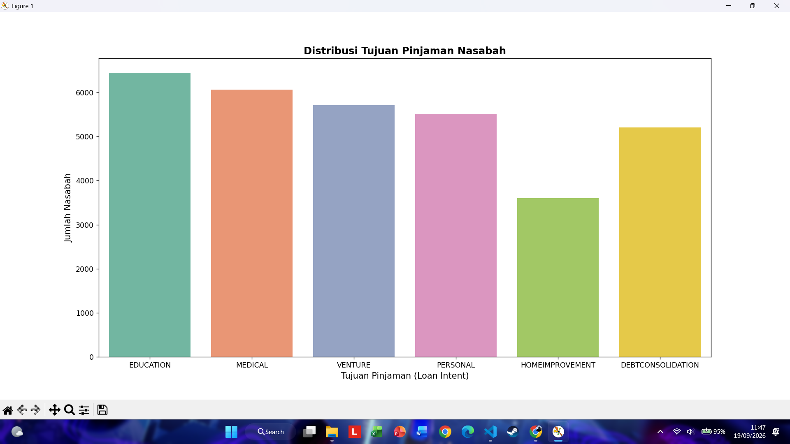
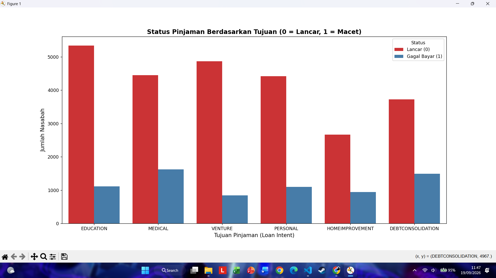
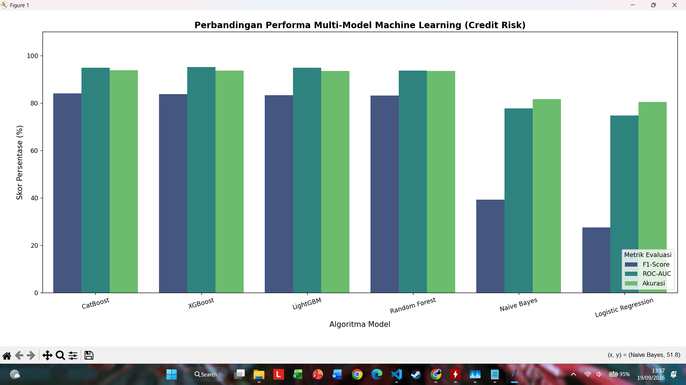
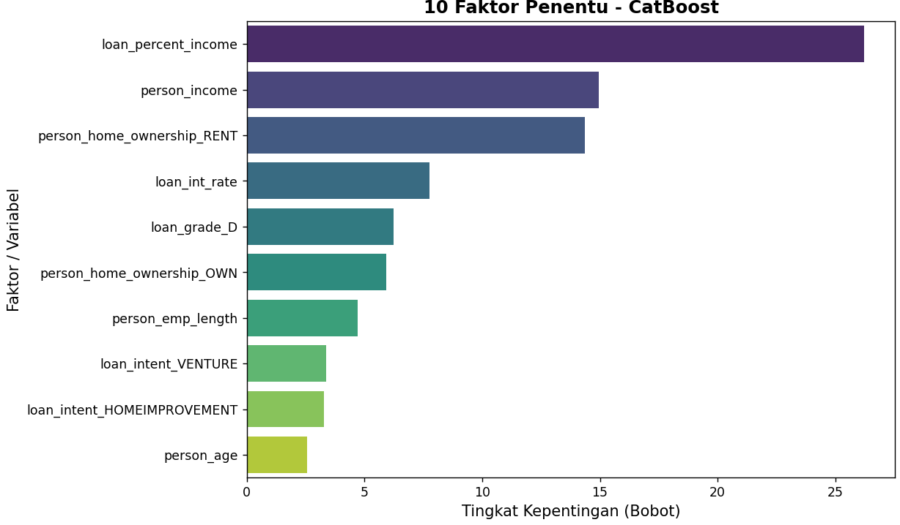

# 🏦 Prediksi Risiko Kredit (Credit Risk Classification)
**End-to-End Data Pipeline & Multi-Model Machine Learning Benchmarking menggunakan Python**

## 📌 Latar Belakang & Objektif Bisnis
Dalam industri perbankan, mengidentifikasi calon nasabah yang berisiko gagal bayar (*default*) sangat krusial untuk meminimalisir status *Non-Performing Loan* (NPL). Proyek ini membangun sistem prediksi risiko kredit komparatif berbasis *machine learning* yang mengklasifikasikan nasabah ke dalam kategori **Lancar (0)** atau **Macet (1)** berdasarkan profil historis, data finansial, dan tujuan pinjaman mereka.

## 📈 Analisis Eksploratif Data (EDA)
Sebelum membangun model prediktif, analisis awal dilakukan untuk memahami karakteristik dan distribusi data nasabah berdasarkan tujuan peminjaman (*loan intent*).

### 1. Distribusi Tujuan Pinjaman Nasabah
Grafik di bawah ini menunjukkan sebaran volume pemohon berdasarkan alasan atau tujuan pengajuan pinjaman:



*   **Insight Volume:** Kategori **EDUCATION** (Pendidikan) dan **MEDICAL** (Medis) mendominasi jumlah pengajuan pinjaman terbanyak dari total keseluruhan nasabah, diikuti oleh kategori *Venture* dan *Debt Consolidation*.

### 2. Status Pinjaman Berdasarkan Tujuan (Lancar vs Gagal Bayar)
Untuk melihat korelasi awal terhadap risiko kredit, setiap kategori tujuan pinjaman dipecah berdasarkan status kelancaran pembayaran (0 = Lancar, 1 = Gagal Bayar):



*   **Insight Risiko Bisnis:** Terlihat jelas bahwa kategori **MEDICAL** dan **DEBTCONSOLIDATION** memiliki proporsi batang biru (Gagal Bayar/1) yang relatif lebih tinggi dibandingkan volumenya, mengindikasikan bahwa pinjaman untuk keperluan medis dan konsolidasi utang memiliki tingkat kerentanan gagal bayar yang lebih besar. Sebaliknya, kategori **VENTURE** menunjukkan rasio risiko yang relatif lebih aman.

## 🗄️ Exploratory Data Analysis & Risk Profiling via SQL

Sebelum tahap pemodelan prediktif dengan Python, analisis awal dan validasi integritas data dilakukan langsung dari database relasional menggunakan SQLite (`credit_risk_database.db`).

### Kueri SQL Utama:
1. **Analisis Rasio Portofolio Gagal Bayar (Loan Default Rate):**
   ```sql
   SELECT 
       loan_status,
       COUNT(*) AS total_nasabah,
       ROUND(COUNT(*) * 100.0 / (SELECT COUNT(*) FROM credit_risk_bersih), 2) AS persentase
   FROM credit_risk_bersih
   GROUP BY loan_status;
2. **Pemetaan Risiko Berdasarkan Tujuan Pinjaman (loan_intent):**
   ```sql
   SELECT 
    loan_intent AS tujuan_pinjaman,
    COUNT(*) AS total_nasabah,
    SUM(loan_status) AS total_gagal_bayar,
    ROUND(AVG(loan_status) * 100.0, 2) AS default_rate_persen,
    ROUND(AVG(loan_amnt), 2) AS rata_rata_nominal_pinjaman
   FROM credit_risk_bersih
   GROUP BY loan_intent
   ORDER BY default_rate_persen DESC;
3. **Validasi Prinsip Risk-Based Pricing (loan_grade):**
   ```sql
   SELECT 
    loan_grade AS peringkat_kredit,
    COUNT(*) AS total_nasabah,
    SUM(loan_status) AS total_gagal_bayar,
    ROUND(AVG(loan_status) * 100.0, 2) AS default_rate_persen,
    ROUND(AVG(loan_int_rate), 2) AS rata_rata_suku_bunga
   FROM credit_risk_bersih
   GROUP BY loan_grade
   ORDER BY loan_grade ASC;
   
Berdasarkan hasil Temuan Bisnis yang Didapatkan (Business Insight):

### 1. Profil Risiko Berdasarkan Tujuan Pinjaman (`loan_intent`)
Kueri SQL dijalankan untuk memetakan kategori pinjaman dengan rasio kredit macet (*default rate*) tertinggi:

| Tujuan Pinjaman | Total Nasabah | Total Gagal Bayar | Default Rate (%) | Rata-rata Pinjaman ($) |
| :--- | :---: | :---: | :---: | :---: |
| **DEBTCONSOLIDATION** | 5.212 | 1.490 | **28,59%** | $9.594,89 |
| **MEDICAL** | 6.070 | 1.621 | **26,71%** | $9.260,04 |
| **HOMEIMPROVEMENT** | 3.605 | 941 | **26,10%** | $10.360,52 |
| **PERSONAL** | 5.518 | 1.097 | **19,88%** | $9.569,92 |
| **EDUCATION** | 6.451 | 1.111 | **17,22%** | $9.481,53 |
| **VENTURE** | 5.716 | 847 | **14,82%** | $9.580,97 |

### 2. Validasi Prinsip *Risk-Based Pricing* (`loan_grade`)
Kueri SQL dijalankan untuk melihat hubungan antara peringkat kualitas kredit, suku bunga, dan potensi gagal bayar:

| Peringkat (*Grade*) | Total Nasabah | Total Gagal Bayar | Default Rate (%) | Suku Bunga Rata-rata (%) |
| :---: | :---: | :---: | :---: | :---: |
| **A** | 10.775 | 1.073 | **9,96%** | 7,67% |
| **B** | 10.448 | 1.701 | **16,28%** | 10,99% |
| **C** | 6.455 | 1.339 | **20,74%** | 13,22% |
| **D** | 3.625 | 2.140 | **59,03%** | 14,99% |
| **E** | 964 | 621 | **64,42%** | 16,49% |
| **F** | 241 | 170 | **70,54%** | 17,76% |
| **G** | 64 | 63 | **98,44%** | 19,53% |

### 💡 Temuan Bisnis Utama (*Main Business Insight*):
* **Tujuan Pinjaman Paling Berisiko:** Kategori `DEBTCONSOLIDATION` (28,59%) dan `MEDICAL` (26,71%) memiliki tingkat gagal bayar tertinggi, menandakan debitur pada kategori ini berada dalam tekanan finansial yang rentan.
* **Titik Kritis Kelayakan Kredit (*The Tipping Point*):** Terjadi lonjakan drastis tingkat kredit macet dari Grade C (20,74%) ke Grade D (59,03%). Lebih dari separuh nasabah pada Grade D ke bawah terbukti gagal bayar, membenarkan mengapa bank menetapkan suku bunga jauh lebih tinggi pada segmen ini.

### 💡 Mengapa Memilih Machine Learning ketimbang Metode Tradisional?
Meskipun model tradisional (seperti Logistic Regression) lebih sederhana, mereka sering kali gagal menangkap pola data keuangan yang kompleks. Proyek ini menerapkan **Machine Learning (khususnya *Gradient Boosting*)** karena keunggulan mutlaknya:
*   **Pola Non-Linear:** Mampu memetakan interaksi tersembunyi antar-variabel yang terlalu kaku jika dihitung dengan rumus statistik biasa.
*   **Minimalisir Risiko (*Recall* Tinggi):** Jauh lebih efektif mendeteksi nasabah macet secara akurat dan mencegah kerugian finansial bank.
*   **Objektivitas Data:** Algoritma secara mandiri menyusun aturan keputusan terbaik berdasarkan bobot data riil melalui *Feature Importance*.

## 🗄️ Dataset & Preprocessing
*   **Sumber:** Credit Risk Dataset
*   **Dimensi Data Awal:** 32.572 baris dan 12 kolom fitur.
*   **Dimensi Setelah Encoding:** 32.572 baris dan 23 kolom (setelah diterapkan *One-Hot Encoding*).
*   **Data Splitting:** Rasio 80% Data Latih (26.057 baris) dan 20% Data Uji (6.515 baris).

## 🛠️ Metodologi & Model Benchmarking
Proyek ini menguji dan membandingkan **6 algoritma *machine learning* berbeda** secara paralel untuk menemukan solusi prediktif paling optimal bagi institusi keuangan:
1. Logistic Regression
2. Naive Bayes
3. Random Forest
4. XGBoost
5. LightGBM
6. CatBoost

## 📊 Hasil Perbandingan Performa Model (*Benchmarking Result*)

Berikut adalah tabel rekapitulasi performa keenam model yang diuji pada data uji (6.515 baris):

| Model | Akurasi (%) | Presisi (%) | Recall (%) | F1-Score (%) | ROC-AUC (%) |
| :--- | :---: | :---: | :---: | :---: | :---: |
| **CatBoost** | **93.81** | **96.63** | 74.33 | **84.03** | 94.85 |
| **XGBoost** | 93.63 | 94.85 | **74.96** | 83.74 | **95.21** |
| **LightGBM** | 93.55 | 96.32 | 73.35 | 83.28 | 94.90 |
| **Random Forest** | 93.48 | 95.54 | 73.63 | 83.17 | 93.62 |
| **Naive Bayes** | 81.61 | 70.88 | 27.14 | 39.25 | 77.68 |
| **Logistic Regression** | 80.37 | 71.68 | 17.04 | 27.54 | 74.69 |

### 📈 Grafik Perbandingan Multi-Model


## 🔍 Analisis Mendalam & Wawasan Bisnis (*Business Insights*)

*   **Dominasi Algoritma Gradient Boosting:** Model berbasis *boosting* (**CatBoost, XGBoost, dan LightGBM**) terbukti jauh unggul dibanding model tradisional. Hal ini karena arsitekturnya mampu memetakan interaksi non-linear yang kompleks di dalam data finansial.
*   **Model Produksi Terbaik:** **CatBoost** dinobatkan sebagai model terbaik dengan perolehan **F1-Score 84.03%**, memberikan keseimbangan optimal dalam mendeteksi nasabah macet sekaligus menekan angka kesalahan tuduhan (*False Positives*).
*   **Kelemahan Model Linear:** Model tradisional seperti Logistic Regression dan Naive Bayes mengalami *underperforming* parah pada metrik *Recall*, di mana sebagian besar nasabah macet gagal terdeteksi (*False Negatives* tinggi).

### 🏆 Faktor Penentu Kredit Macet (*Feature Importance*)


Berdasarkan analisis model terbaik, tiga pemicu utama kredit macet adalah:
1.  **Rasio Pinjaman terhadap Pendapatan (`loan_percent_income`):** Indikator bahaya paling mutlak. Beban cicilan yang memakan porsi terlalu besar dari gaji bulanan meningkatkan risiko gagal bayar secara drastis.
2.  **Total Pendapatan (`person_income`):** Menunjukkan kapasitas finansial absolut nasabah.
3.  **Status Tempat Tinggal (`person_home_ownership_RENT`):** Profil nasabah dengan status sewa/kontrak menunjukkan pola risiko finansial yang khas.

## 💻 **Tech Stack**
* **Bahasa Pemrograman & Kueri:** Python 3, SQL
* **Basis Data & Tools:** SQLite, DB Browser for SQLite
* **Pustaka Analitik:** Pandas, NumPy
* **Pustaka Machine Learning:** Scikit-Learn, XGBoost, LightGBM, CatBoost
* **Pustaka Visualisasi:** Matplotlib, Seaborn
